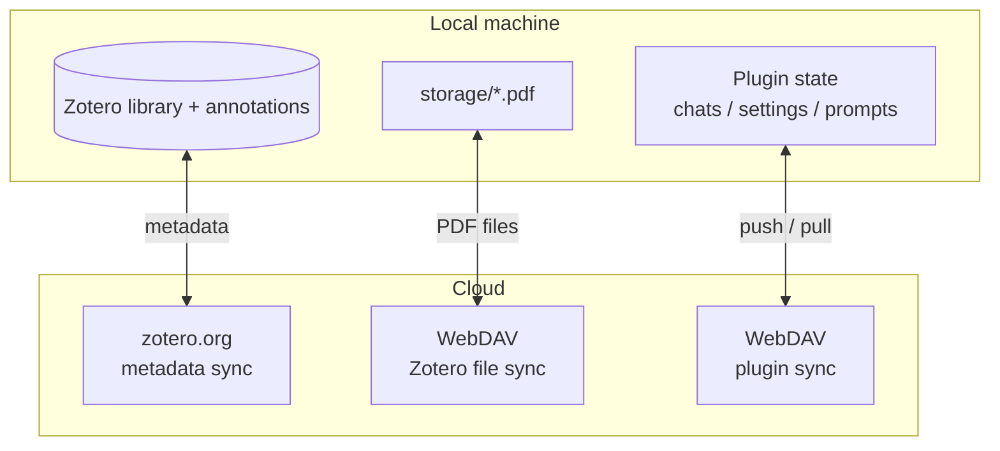
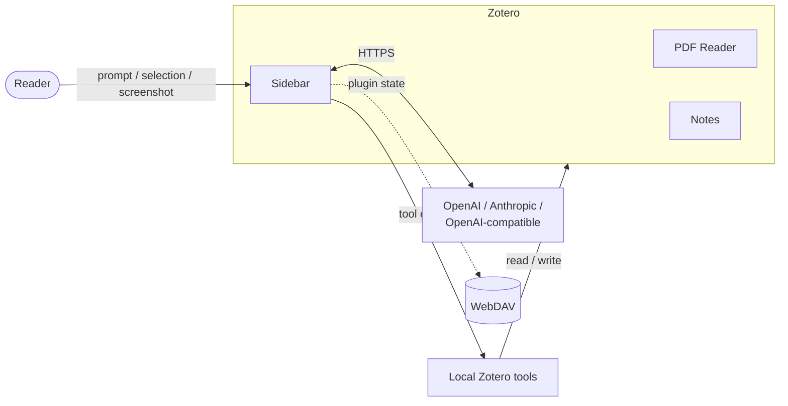

# Zotero AI Sidebar

[中文](README.md) | [English](README.en.md)

Keep the small paper-reading tasks inside Zotero: ask questions, translate a paragraph, translate the full PDF, turn answers into notes, and send screenshots when text is not enough.

This is not a separate chat app. It is a sidebar next to Zotero's PDF reader. The sidebar follows the current paper, and the conversation stays attached to that paper.


## What It Is For

Reading a paper often means interrupting yourself:

- copy a PDF paragraph into a translation tool;
- copy title, abstract, and selected text into a chat app;
- send a screenshot to ask about a figure;
- move the answer back into a Zotero note;
- switch machines and lose the context of what you asked.

Zotero AI Sidebar is built around that loop. You keep reading in Zotero, with a sidebar that can use the current paper as context.

## How It Feels In Use

### Click a paragraph to translate it


Turn on `Point Translate`, click a PDF paragraph, and the translation appears in the sidebar conversation. No extra floating box covers the PDF.

If you already ran full-text translation, point translation will reuse the cached paragraph result when possible.

### Start with a rough question

For example:

```text
What problem does this paper solve, and are the method and experiments convincing?
```

Or:

```text
Organize this paper by problem, method, experiments, and limitations.
```

The sidebar can read the current Zotero item, PDF text, selected text, and annotations, so you do not need to copy context manually.

### Save useful answers as Zotero notes

After reading, ask for a structured note:

```text
Create a literature note with background, method, experiments, results, limitations, and follow-up questions.
```

When the answer looks useful, use `Write to Note` to append it to the current Zotero item.

## The Buttons Near The Composer


- `Summarize`: get a paper overview.
- `Full-text key points`: read the full PDF and collect notable points.
- `Explain selection`: ask about selected PDF text.
- `Queue`: revisit unfinished or completed tasks.
- `Screenshot` / `Image`: send figures, formulas, or UI states.
- `Web`: enable web access when the current PDF is not enough.

The footer also lets you switch model, reasoning level, and YOLO mode. API keys and model settings stay in Zotero preferences.

## Install

1. Download the latest `zotero-ai-sidebar.xpi` from [GitHub Releases](https://github.com/huangkiki/zotero-ai-sidebar/releases/latest).
2. Open Zotero 7, 8, or 9.
3. Go to `Tools` -> `Plugins`.
4. Click the gear icon and choose `Install Plugin From File...`.
5. Select the downloaded `.xpi` file and restart Zotero if prompted.
6. Configure at least one model preset in the sidebar settings.

The repository currently publishes only the `.xpi` file. Zotero automatic update manifests are not published yet.

## Model Setup

Create a model preset in the plugin settings:

- Provider: `openai`, `anthropic`, or an OpenAI-compatible endpoint.
- API key: stored locally in Zotero preferences.
- Base URL: the official URL or your relay endpoint.
- Model: any model supported by that endpoint.
- Max tokens and tool iterations: local controls for length, cost, and tool calls.

Do not commit API keys, base URLs, or private model names.

## What Else It Can Do

- Read current item metadata, selected text, annotations, PDF snippets, and full PDF text.
- Translate a full PDF and keep paragraph results in the paper conversation.
- Translate clicked paragraphs and reuse full-text translation cache.
- Copy answers as Markdown or write them into Zotero child notes.
- Draft PDF annotations using customizable color guidance.
- Use screenshots, images, quick prompts, and slash commands.
- Search arXiv and fetch paper full text.
- Sync chats, prompts, settings, and selected annotations with WebDAV.
- Export and restore settings as JSON.

## Sync Model

Zotero syncs the library and PDF files. The plugin syncs its own extra state, such as conversations, quick prompts, and selected annotation state.



This keeps Zotero's normal sync intact while giving the plugin a separate backup path.

## How It Works

The sidebar exposes real Zotero operations as local tools: read the current paper, search the PDF, read full text, write notes, or draft annotations. The model decides which tool to call and with what arguments; the plugin validates and runs the operation locally.



## Development

Install dependencies:

```bash
npm install
```

Run tests:

```bash
npm test
```

Build a local XPI:

```bash
npm run build
```

Build output is written to `.scaffold/build/`. Local `.xpi` files are ignored by Git.

## Release

After the working tree is clean and `package.json` has the desired version:

```bash
npm run release:xpi
```

The script runs tests, builds the XPI, creates and pushes the matching `v<version>` tag, waits for GitHub Actions, and uploads `.scaffold/build/*.xpi` to the GitHub Release.

More details are in [docs/RELEASE.md](docs/RELEASE.md).

## License

AGPL-3.0-or-later.
