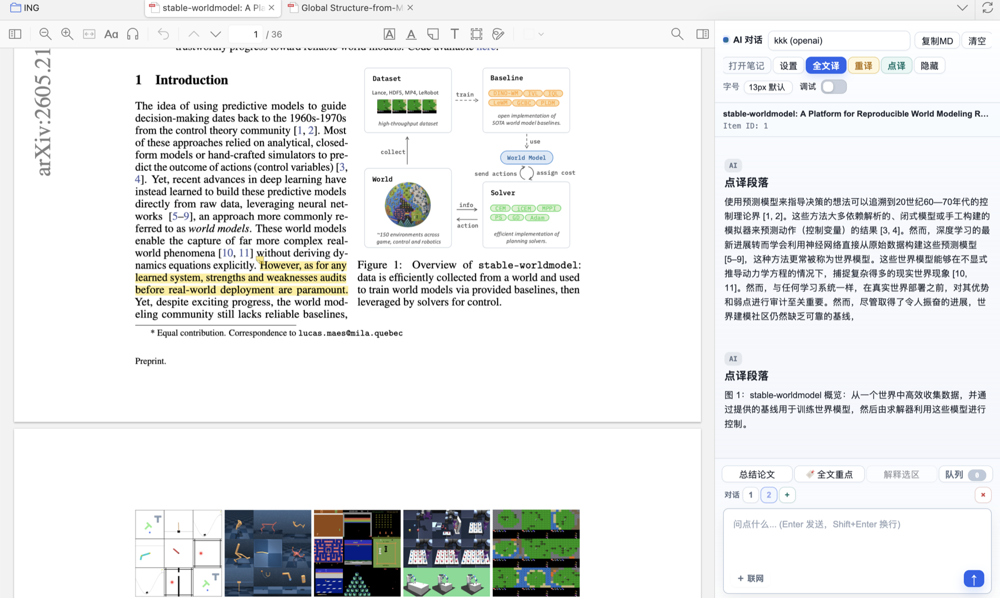
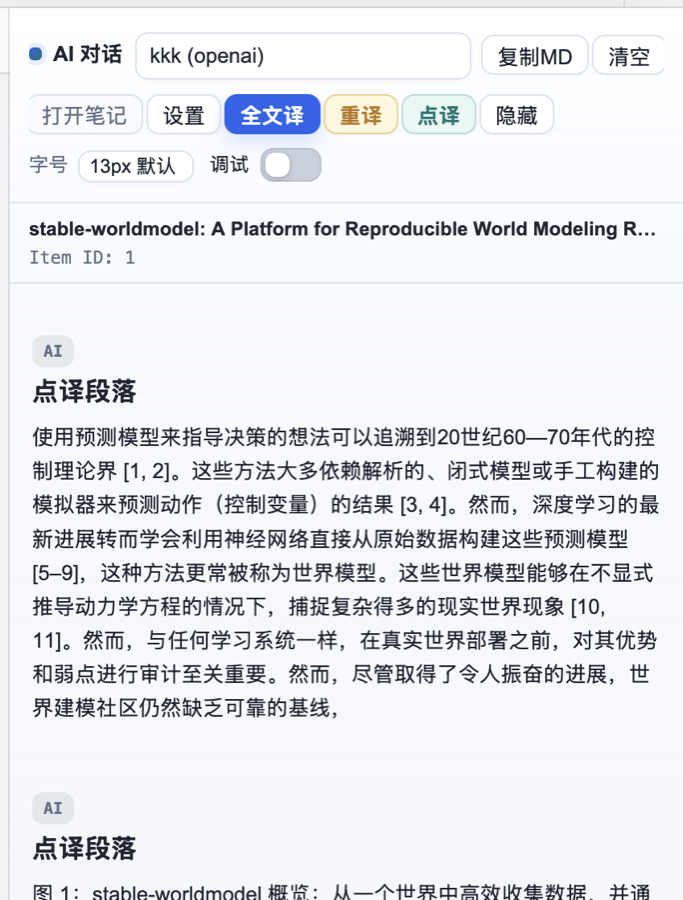
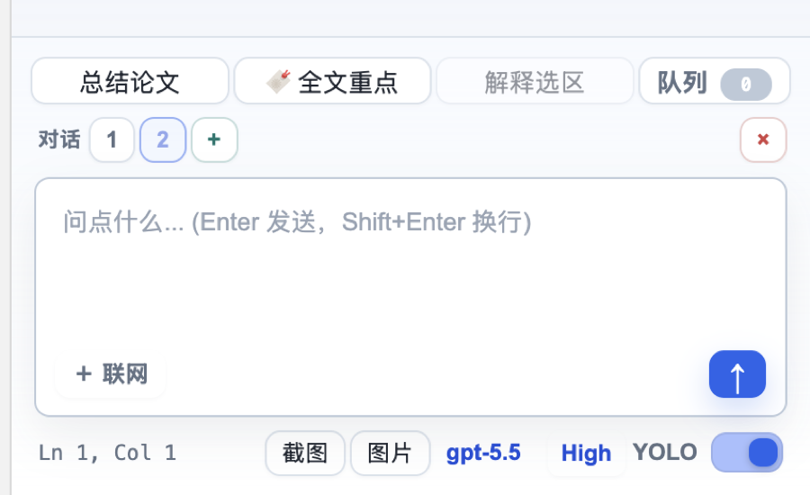
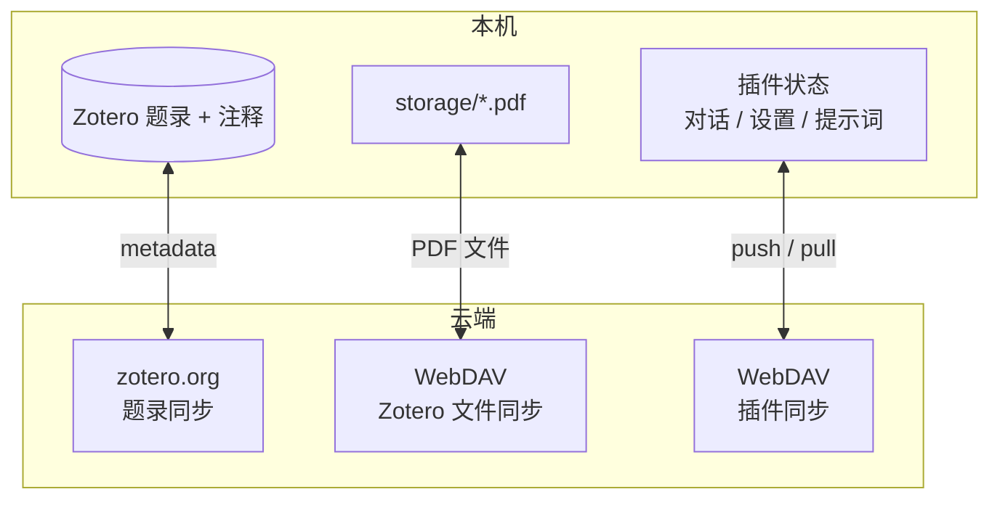
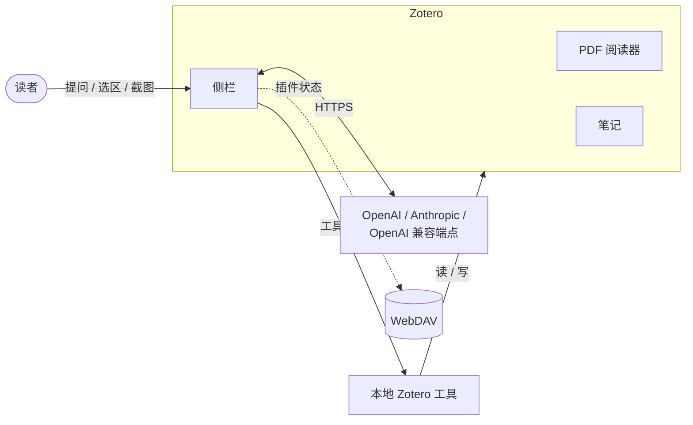

# Zotero AI Sidebar

[中文](README.md) | [English](README.en.md)

把论文阅读时最常用的几件事放回 Zotero：提问、点译、全文翻译、整理笔记、截图追问。

这个插件不是一个单独的聊天窗口，而是 Zotero 右侧的一条阅读侧栏。你打开 PDF，它跟着当前论文走；你问的问题、点译的段落、整理出来的笔记，也都留在这篇论文下面。



## 它适合解决什么问题

读论文时，很多小动作其实很打断节奏：

- 复制一段 PDF 文字去翻译；
- 把摘要、标题、选区复制给聊天工具；
- 截图问图表含义；
- 把回答再搬回 Zotero 笔记；
- 换电脑后发现之前的对话不在了。

Zotero AI Sidebar 主要就是把这些动作收回来。你仍然在 Zotero 里读 PDF，只是在右侧多了一块可以理解当前论文上下文的侧栏。

## 怎么读起来

### 看到不顺的段落，直接点译



开启 `点译` 后，点击 PDF 里的段落，译文会出现在右侧对话里。它不会额外弹一个浮动框挡住 PDF。

如果你之前已经跑过 `全文译`，点译会优先使用缓存译文。也就是说，同一段不会反复请求模型。

### 想快速进入论文，就先问一个粗问题

比如：

```text
这篇论文主要解决什么问题？方法和实验分别可靠吗？
```

或者更具体一点：

```text
请按“问题、方法、实验、局限”整理这篇论文。
```

侧栏可以读取当前 Zotero 条目、PDF 文字、选区和注释。你不用先手动复制一堆上下文。

### 要沉淀下来，就写回 Zotero 笔记

读完一轮后，可以让它整理成笔记：

```text
整理成文献笔记：背景、核心方法、实验设置、主要结果、局限、我后续可以追的问题。
```

确认内容可用后，点 `写入笔记`，结果会追加到当前 Zotero 条目的子笔记里。

## 侧栏里几个按钮是干什么的



- `总结论文`：让模型先读当前论文，给一个概览。
- `全文重点`：读完整篇 PDF，整理值得标记的重点。
- `解释选区`：选中 PDF 文字后，围绕选区提问。
- `队列`：查看还没处理完，或之前已经完成的任务。
- `截图` / `图片`：把图表、公式、界面状态一起发给模型。
- `联网`：需要查当前论文之外的信息时再打开。

底部也可以切换模型、推理等级和 YOLO 模式。API Key 和模型配置都保存在 Zotero 本地偏好里。

## 安装

1. 从 [GitHub Releases](https://github.com/huangkiki/zotero-ai-sidebar/releases/latest) 下载最新版 `zotero-ai-sidebar.xpi`。
2. 打开 Zotero 7、8 或 9。
3. 进入 `工具` -> `插件`。
4. 点击齿轮图标，选择 `从文件安装插件...`。
5. 选择刚下载的 `.xpi` 文件，按提示重启 Zotero。
6. 在侧栏设置里配置一个模型预设。

目前只发布 `.xpi` 文件，暂时没有 Zotero 自动更新清单。更新时重新安装最新版 `.xpi` 即可。

## 配置模型

在插件设置里新增一个模型预设：

- 提供商：`openai`、`anthropic`，或 OpenAI 兼容端点。
- API Key：保存在本地 Zotero 偏好中。
- Base URL：官方地址，或你自己的中转地址。
- 模型：填写该端点支持的模型 ID。
- Max tokens / 工具循环上限：控制输出长度、成本和工具调用次数。

不要把 API Key、Base URL 或私有模型名写进仓库。

## 还能做什么

- 读取当前条目元信息、PDF 选区、注释、PDF 片段和 PDF 全文。
- 全文翻译，并把段落译文存进当前论文的聊天记录。
- 点译段落，并复用全文翻译缓存。
- 把回答复制成 Markdown，或写入 Zotero 子笔记。
- 按自定义颜色规则起草 PDF 注释。
- 支持截图、图片、快捷提示词和 slash 命令。
- 支持 arXiv 检索和全文抓取。
- 支持 WebDAV 同步聊天、提示词、设置和选定注释。
- 支持 JSON 配置备份与恢复。

## 同步怎么分工

Zotero 自己同步题录和 PDF 文件；这个插件同步的是它额外产生的内容，例如聊天记录、快捷提示词和部分注释状态。



这样做的好处是：Zotero 原来的同步方式不需要改，插件自己的阅读现场也可以单独备份。

## 简单说一下工作原理

侧栏会把 Zotero 里的真实操作暴露成本地工具，比如读取当前论文、搜索 PDF、读取全文、写入笔记、起草注释。模型只决定“要不要调用工具、调用哪个工具、参数是什么”，真正的读写都由插件在本机执行。



## 开发

安装依赖：

```bash
npm install
```

运行测试：

```bash
npm test
```

构建 XPI：

```bash
npm run build
```

构建产物会写入 `.scaffold/build/`。本地 `.xpi` 文件已被 Git 忽略，不应提交。

## 发布

当工作区干净、`package.json` 里的版本号也准备好后：

```bash
npm run release:xpi
```

脚本会运行测试、构建 XPI、创建并推送匹配的 `v<version>` tag，等待 GitHub Actions，并把 `.scaffold/build/*.xpi` 上传到 GitHub Release。

更多细节见 [docs/RELEASE.md](docs/RELEASE.md)。

## 许可证

AGPL-3.0-or-later。
