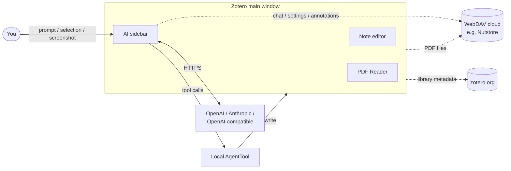
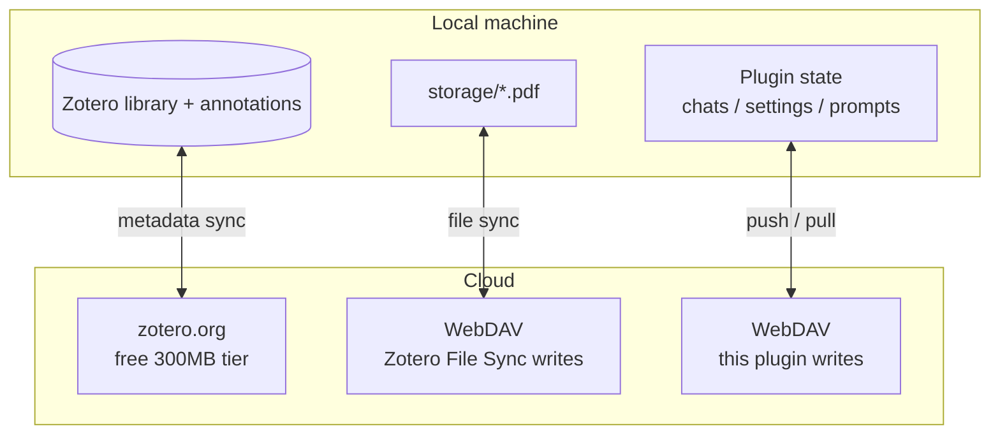

# Zotero AI Sidebar

[English](README.md) | [中文](README.zh-CN.md)

Zotero AI Sidebar is a Zotero 7/8/9 plugin that adds an AI chat panel to the Zotero item pane / PDF reading workflow. It is designed as a lightweight research agent: the model decides when to inspect the current Zotero item, annotations, PDF snippets, full PDF text, screenshots, or write annotations through exposed Zotero tools.

📖 **[Full usage guide (HTML, Chinese)](docs/usage.html)** — step-by-step install, config, slash commands, cloud sync, and disaster backup.

## Architecture



## Three-layer cloud-sync split



## Features

- **AI chat inside Zotero**: open a dedicated sidebar and discuss the current paper without leaving Zotero.
- **Configurable providers**: supports Anthropic, OpenAI, and OpenAI-compatible endpoints through local Zotero preferences. Model presets include connectivity tests and a per-preset model list with a footer switcher.
- **Model-driven Zotero tools**: follows a Codex-style tool loop; no local keyword/regex intent planner decides what PDF content to send.
- **PDF context tools**: current item metadata, annotations, PDF search, PDF range reading, full PDF reading, and selected-text context.
- **Customizable annotation color guide**: edit the natural-language rubric the model uses when picking PDF highlight colors, with a default that maps Zotero's six preset hexes to common review categories (background, problem, method, dataset, results, etc.).
- **Image context**: attach screenshots/images so the model can analyze figures, UI states, or PDF screenshots.
- **Quick prompts & slash commands**: customizable prompt buttons next to the composer plus built-in slash commands (`/arxiv-search`, `/web-search`) that expand into explicit instructions for the model.
- **arXiv paper tools**: `paper_search_arxiv` and `paper_fetch_arxiv_fulltext` let the model search arXiv and fetch full text on demand.
- **In-pane note editor**: open a note column alongside the chat to edit Zotero's rich note in place, with an assistant-to-note write tool.
- **Model-driven note writes**: the model can also call `zotero_append_to_note` on its own to append assistant output to the current item's child note, auto-creating one when none exists.
- **Markdown output**: renders headings, lists, code blocks, quotes, links, thinking/context blocks, and tool-call traces.
- **Customizable chat UI**: nickname and avatar (emoji or image URL) for both user and AI, plus configurable position and layout for the per-message action buttons.
- **Clean / debug copy modes**: copy the conversation as Markdown with just the paper introduction and dialogue, or include tool context, PDF snippets, and thinking summaries for debugging.
- **Config backup & restore**: export/import account presets, UI settings, quick prompts, and tool/MCP settings as a single JSON file.
- **WebDAV cloud sync**: push and pull chats, settings, quick prompts, and selected paper annotations to a WebDAV endpoint (e.g. Nutstore) via a single `state.json` snapshot, with portable thread keys so conversations follow you across machines.
- **Local-first config**: API keys, base URLs, model names, and private provider settings stay in Zotero prefs, not in source code.

## Install

1. Download the latest `zotero-ai-sidebar.xpi` from GitHub Releases.
2. Open Zotero 7, 8, or 9.
3. Go to `Tools` -> `Plugins`.
4. Click the gear icon and choose `Install Plugin From File...`.
5. Select the downloaded `.xpi` file and restart Zotero if prompted.

This repository currently publishes only the `.xpi` file. Zotero automatic update manifests (`update.json` / `update-beta.json`) are intentionally not published in the simplified release flow.

## Configuration

Open the AI Sidebar settings in Zotero and configure at least one model preset:

- Provider: `anthropic` or `openai`
- API key: stored locally in Zotero preferences
- Base URL: official endpoint or an OpenAI-compatible endpoint
- Model: any model ID supported by that endpoint
- Max tokens / tool iterations: local safety and output controls

Do not hardcode personal API keys, base URLs, or private model IDs in this repository.

## Development

Install dependencies:

```bash
npm install
```

Run tests:

```bash
npm test
```

Build a local XPI:

```bash
npm run build
```

The build output is written to `.scaffold/build/`. Local `.xpi` files are ignored by Git and should not be committed.

## Release Flow

After `/auto-commit` has updated the version and committed the repository, the
release flow is one command:

```bash
npm run release:xpi
```

The script reads `package.json` version and releases `v<version>`. You can also
pass the expected tag explicitly:

```bash
npm run release:xpi -- v0.1.2
```

The script verifies the working tree is clean, runs tests, builds locally, creates
the annotated tag if needed, pushes `master`, pushes the tag, waits for GitHub
Actions, and prints the final Release/XPI URL.

To recreate a deleted GitHub Release for an existing tag without moving the tag:

```bash
npm run release:xpi -- v0.1.2 --republish
```

The lower-level tag-only command is still available when needed:

```bash
npm run release:tag -- v0.1.2
```

The release scripts check that:

- the working tree is clean
- the tag starts with `v`
- the tag matches `package.json` version
- the Git remote exists
- GitHub Actions uploads only `.scaffold/build/*.xpi`

More details are in `docs/RELEASE.md`.

## Agent Design Notes

The project should keep the agent architecture close to Codex-style harness design:

- expose real Zotero operations as structured tools
- let the model decide which tools to call
- validate and execute tool calls locally
- enforce safety budgets in the harness
- require explicit YOLO / approval behavior for write tools
- avoid hardcoded keyword routing and regex-based intent detection

The UI direction follows Claudian-style readability:

- clean Markdown rendering
- visible thinking/context sections
- tool-call trace visibility
- stable scrolling while streaming
- copyable assistant output

See `CLAUDE.md` for project-specific modification guidance.
See `docs/TOOLS_AND_MCP.md` for when to use local tools, Web Search, or MCP.

## License

AGPL-3.0-or-later.
