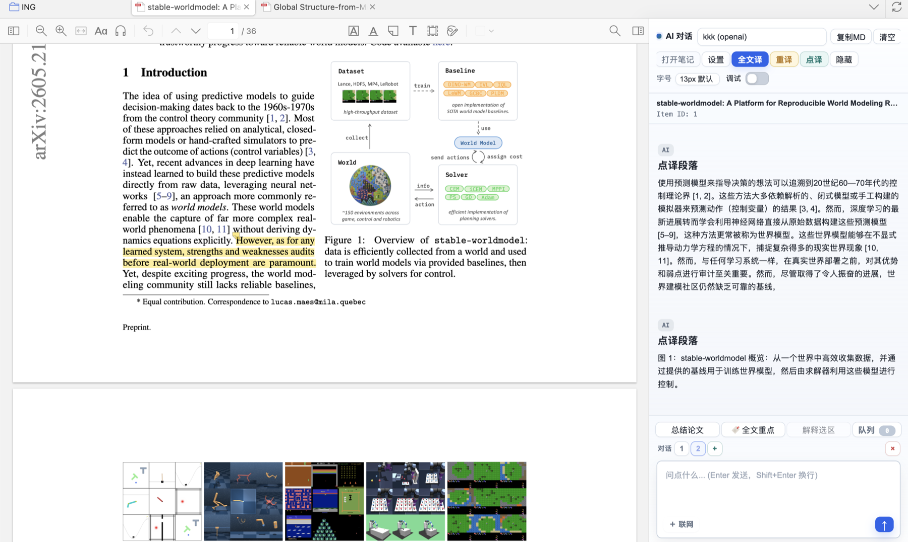
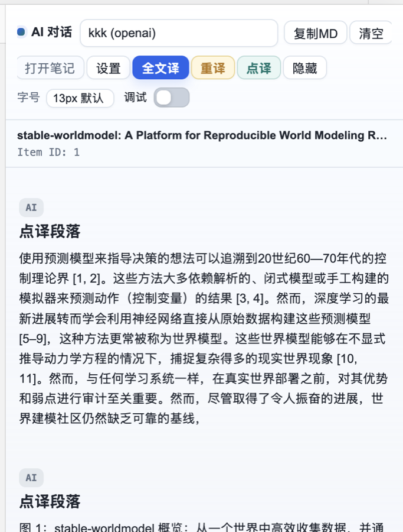

# Zotero AI Sidebar

[English](README.en.md) · [下载安装包](https://github.com/huangkiki/zotero-ai-sidebar/releases/latest) · [反馈问题](https://github.com/huangkiki/zotero-ai-sidebar/issues)

在 Zotero 的 PDF 阅读器旁边提问、翻译、解释选区和整理笔记。对话按论文保存，支持同一篇论文下的多个对话。

支持 **本机 Codex 的 ChatGPT 登录**、**OpenAI Responses API / 兼容服务**和 **Anthropic API**。不同接入方式的功能范围见下文。



> 本地 ChatGPT 接入仍在验证中。目前仍有「模型只看到题录、未调用 PDF 读取工具」的使用反馈，实际 Zotero 场景尚未全部验证通过。检测到账号、能聊天，并不代表 PDF 读取和注释已正常工作。参见[常见问题](#常见问题)。

## 安装与更新

1. 打开 [Releases](https://github.com/huangkiki/zotero-ai-sidebar/releases/latest)，在 **Assets** 中下载 `zotero-ai-sidebar.xpi`。
2. 在 Zotero 中打开 **工具 → 插件**，点击齿轮，选择 **从文件安装插件…**。
3. 选择下载的 `.xpi` 文件，完成安装。
4. 更新旧版后，完全退出并重新打开 Zotero；macOS 使用 **⌘Q** 退出。
5. 打开侧栏的 **设置**，在 **账号与模型** 中配置接入方式。

当前兼容性声明为 **Zotero 7.0 至 10.0.2**；近期适配面向 macOS 上的 Zotero 10.0.2。这一声明不代表所有系统和版本都已完成运行验证。

更新时重新安装最新 `.xpi`，无需先卸载。`Source code (zip)` 是开发源码，不能作为插件安装。本仓库的发布流程暂不提供可用的自动更新清单，请以 Releases 中的安装包为准。

## 界面语言

**一个安装包，支持中英文切换。** 包含语言切换功能的 `zotero-ai-sidebar.xpi` 同时提供中文和英文 UI，无需分别安装两个版本。

**发布状态：v0.3.3 尚不包含语言切换。** 该功能已合并到 `master`。在包含此功能的新版 Release 发布前，可到 [GitHub Actions](https://github.com/huangkiki/zotero-ai-sidebar/actions/workflows/ci.yml) 下载成功的 `master` 构建中的 **build-result**（需登录 GitHub），解压后安装其中的 `.xpi`；也可按下方开发说明自行构建。不能直接安装源码 ZIP 或构建产物 ZIP。

初始界面默认为中文，不随 Zotero 的语言自动切换。在侧栏点击 **设置**（或打开 Zotero 设置中的 **AI 对话**），在顶部 **界面语言** 中选择 **English**，界面会立即刷新并保存选择。切回中文时，在同一选项中选择 **Chinese**。

内置界面文字和未修改的内置快捷提示词会随语言切换；已有论文内容、聊天消息、笔记和自定义提示词保持原样。翻译功能仍以简体中文为目标语言，切换 UI 不改变翻译方向。英文操作说明见 [English README](README.en.md)。

## 选择接入方式

| 接入方式              | 登录或配置                                   | Zotero 文献读取 / 注释工具                | 需要了解的限制                                               |
| --------------------- | -------------------------------------------- | ----------------------------------------- | ------------------------------------------------------------ |
| 本地 ChatGPT（Codex） | 本机 Codex 已通过 ChatGPT 登录，无需 API Key | 已接入，实际使用仍在验证                  | 使用 Codex 可用模型和额度；依赖本机 Codex App Server         |
| OpenAI / OpenAI 兼容  | API Key、Base URL、模型 ID                   | 支持，服务端须支持 Responses API 工具调用 | 仅支持 Chat Completions 的服务不适用                         |
| Anthropic             | API Key、可选 Base URL、模型 ID              | 暂未实现工具循环                          | 可对话并接收已附带的选区或图片，不能依靠工具自动读取整篇 PDF |

### 本地 ChatGPT（Codex）

这里复用的是 **Codex 的 ChatGPT 账号登录**。仅在浏览器中登录 ChatGPT，不等于本机 Codex 已登录。

1. 安装 ChatGPT/Codex 桌面应用或 [Codex CLI](https://learn.chatgpt.com/docs/auth)。
2. 如果尚未登录，在终端运行 `codex login` 并完成登录。可用 `codex login status` 检查状态。
3. 在插件设置的 **账号与模型** 中点击 **检测本地 ChatGPT 登录**。
4. 检测到可用模型后，点击 **保存账号配置**。
5. 回到侧栏，选择 **本地 ChatGPT（Codex）** 和需要的模型。

macOS 上会搜索 ChatGPT/Codex 应用内、Homebrew 和 `PATH` 中的 Codex。登录凭据由 Codex 管理；插件通过本机标准输入输出连接 [Codex App Server](https://learn.chatgpt.com/docs/app-server)，不会读取浏览器 Cookie，也不会把 ChatGPT 登录令牌复制到 Zotero 偏好中。

本地模式使用 Codex 默认的推理参数和输出长度。侧栏中的联网开关目前只对 OpenAI Responses 接入生效。

### OpenAI / Anthropic API

在 **账号与模型** 中点击 **+ OpenAI** 或 **+ Anthropic**，填写：

- **API Key**：对应服务的密钥。
- **Base URL**：使用官方服务时可留空；使用兼容服务时填写其 API 地址。
- **Models**：该服务实际提供的模型 ID，可保存多个并在侧栏切换。
- **Max tokens**：输出长度配置。OpenAI 保存测试会探测服务是否接受该参数。

点击 **保存账号配置**。新增或修改的配置会先经过连接检查；检测失败时，按状态提示检查地址、模型、密钥和接口兼容性。

## 阅读一篇论文

打开 PDF，在侧栏选择账号与模型，然后直接输入问题，例如：

```text
请读取这篇论文，按研究问题、核心方法、实验结果和局限整理，并给出原文依据。
```

模型需要正文时，会通过 Zotero 工具读取 PDF；工具调用记录会显示在对话中。标题和摘要不等于全文，模型表示没有正文时应先排查读取问题。

### 快捷按钮

| 按钮        | 用途                                        | 使用条件                                                            |
| ----------- | ------------------------------------------- | ------------------------------------------------------------------- |
| 总结论文    | 发送论文总结提示词，由模型按需读取原文      | 选择可用模型；自动读取 PDF 需要工具支持                             |
| 🔖 全文重点 | 寻找重要段落，并通过工具写入 PDF 高亮与注释 | OpenAI 或本地 ChatGPT；当前论文的 PDF 已在 Reader 中打开；开启 YOLO |
| 解释选区    | 解释选中的文字，可生成注释建议              | 先在 PDF 中选中文字；侧栏应显示选区提示                             |
| 全文译      | 分段翻译论文，并将结果保存到论文对话中      | 配置翻译账号和模型                                                  |
| 点译        | 点击 PDF 段落，在对话中查看译文             | 开启点译并配置翻译账号和模型                                        |
| 重译        | 重新发起全文翻译                            | 会产生新的模型请求                                                  |
| 截图 / 图片 | 把图表或公式附在问题中                      | 所选模型支持图片输入                                                |
| 打开笔记    | 查看和整理当前论文的笔记                    | 当前对话关联 Zotero 条目                                            |

**YOLO 是写入权限开关。** 普通模式拒绝模型调用需要审批的写入工具；开启后，模型可以按请求写入高亮、注释和笔记，无需逐次确认。读取论文和普通问答不需要开启 YOLO。

### 翻译与笔记

翻译功能面向 **英文译为简体中文**。在设置的 **逐段翻译设置** 中选择 OpenAI 或本地 ChatGPT 账号及模型。翻译配置与对话当前选择的模型可以不同。



点译会尝试复用已有全文翻译缓存；缓存未命中或结果无效时仍会请求模型。可以在回答下复制 Markdown、保存笔记，或使用注释建议卡片把内容写回 PDF。

## 常见问题

### 能聊天，但模型说「没有 PDF 正文」或「没有 Zotero 工具」

1. 在 **工具 → 插件** 中确认安装并启用了最新版本。v0.3.3 开始为本地 ChatGPT 接入 Zotero 工具调用。
2. 更新后完全退出并重启 Zotero，再打开 PDF，确认侧栏标题对应当前论文。
3. 新建一个对话测试，观察是否出现读取 PDF 的工具记录。重启只是排查步骤，不能保证解决问题。
4. 如果仍然失败，请在 [Issues](https://github.com/huangkiki/zotero-ai-sidebar/issues) 中提供插件版本、Zotero 版本、系统、接入方式，以及工具记录或错误截图。侧栏有 **调试** 开关，可辅助定位。

本地 ChatGPT 的此类反馈仍在排查中。扫描版 PDF 或无法提取文字的附件，也可能无法提供可用正文。插件没有内置 OCR，正文读取也有长度和范围限制，不能保证任何 PDF 都完整提取。

### 「全文重点」是灰色

检查是否选中了 OpenAI 或本地 ChatGPT 账号、当前论文的 PDF 是否已打开，以及 YOLO 是否开启。将鼠标停在按钮上可查看禁用原因。

### 「解释选区」是灰色

先用鼠标在 PDF 中选中一段文字。只有检测到文本选区时按钮才可用；选中图片或仅打开 PDF 不会产生文本选区。若侧栏未出现选区提示，请重新选择并检查调试记录。单纯解释选区不需要开启 YOLO。

### 检测不到本地 ChatGPT 登录

先运行 `codex login status`。未登录时运行 `codex login`；登录过期后完成重新登录，再点击插件中的检测按钮。安装了桌面应用但未检测到 Codex 时，请附上系统及安装方式反馈。

### 安装时提示不兼容

确认选择的是 Release 中的 `.xpi`，并核对 Zotero 版本是否处于声明范围内。不要选择源码 ZIP，也不要把其他插件的安装包改名后安装。

## 数据、备份与同步

对话按论文保存在本机，支持多个对话、任务队列、快捷提示词和 JSON 配置备份。插件也支持 WebDAV 同步自己的对话、设置、提示词及部分注释状态；它不替代 Zotero 自身的题录和 PDF 文件同步。

调用模型时，相关提问、选区、图片及工具读取的文献内容会发送到所选服务。本地 ChatGPT 登录方式同样需要联网请求模型，并非离线推理。

API Key 保存在 Zotero 偏好中。配置备份和 WebDAV 设置快照可能包含密钥，请勿公开上传这些文件。ChatGPT 登录令牌由 Codex 单独管理，不包含在插件的模型预设中。

## 开发与发布

CI 使用 Node.js 22。克隆仓库后运行：

```bash
npm ci
npm test
npm run build
```

安装包生成在 `.scaffold/build/zotero-ai-sidebar.xpi`。格式和静态检查命令为 `npm run lint:check`。

**推送代码不会自动更新 Release。** 修改并提交 `package.json` 与 `package-lock.json` 的版本后，在干净工作区中运行：

```bash
npm run release:xpi
```

该脚本需要 GitHub CLI `gh`，会测试、构建、推送版本标签，并等待 GitHub Actions 的 **Release XPI** 工作流发布安装包。也可以在 GitHub Actions 中手动运行该工作流。详见[发布说明](docs/RELEASE.md)。

## 项目与许可证

本仓库基于 [xuhan-rgb/zotero-ai-sidebar](https://github.com/xuhan-rgb/zotero-ai-sidebar) 继续开发。

采用 [AGPL-3.0-or-later](LICENSE) 许可证。
