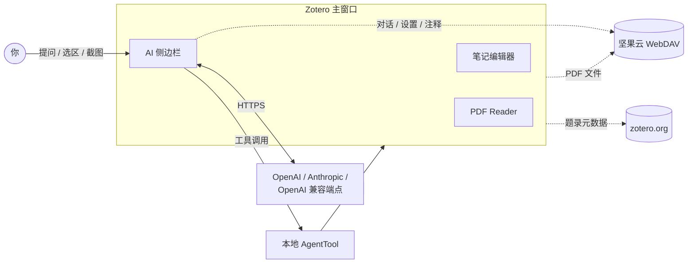
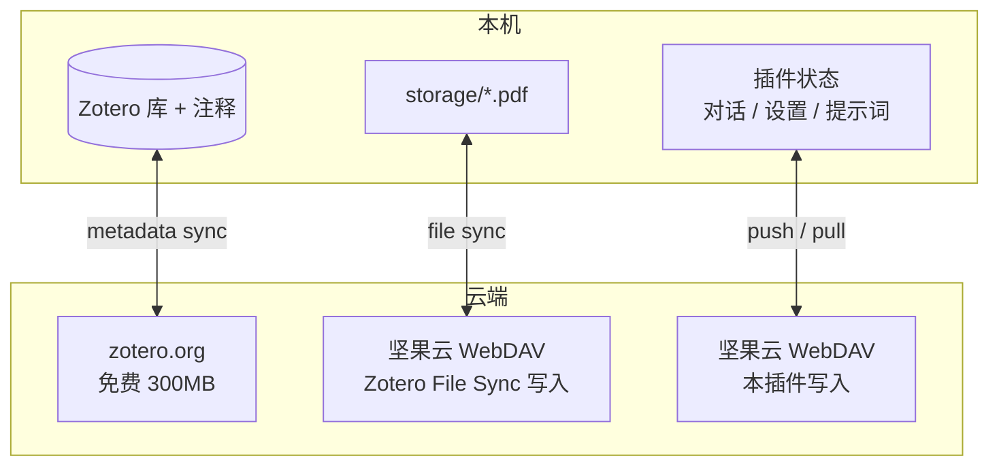

# Zotero AI Sidebar

[English](README.md) | [中文](README.zh-CN.md)

Zotero AI Sidebar 是一个适配 Zotero 7/8/9 的插件，会在条目面板 / PDF 阅读流程旁边加上一个 AI 对话面板。它被设计成一个轻量的论文研究 agent：由模型自己决定何时去查看当前 Zotero 条目、批注、PDF 片段、PDF 全文、截图，或通过插件暴露的 Zotero 工具写入批注。

📖 **[完整使用指南（HTML 网页）](docs/usage.html)** —— 含安装、配置、Slash 命令、云同步、灾备的分步说明

## 总体架构



## 三层云同步分工



## 功能特性

- **Zotero 内置 AI 对话**：直接在专属侧边栏与当前论文对话，无需离开 Zotero。
- **多提供商可配置**：通过 Zotero 本地偏好支持 Anthropic、OpenAI 以及任何 OpenAI 兼容端点。账号预设支持连通性测试，可为每个预设配置独立的模型列表并通过底部切换器快速切换。
- **由模型驱动的 Zotero 工具**：使用 Codex 风格的工具循环；不靠本地关键词/正则的意图判定来决定该把哪些 PDF 内容塞给模型。
- **PDF 上下文工具**：当前条目元信息、批注、PDF 全文检索、PDF 区间阅读、PDF 全文阅读，以及划选文本作为上下文。
- **图像上下文**：可以附带截图或图片，让模型分析图表、界面状态或 PDF 截图。
- **快捷提示词与 Slash 命令**：在输入框旁边可自定义提示词按钮，并内置 `/arxiv-search`、`/web-search` 等 slash 命令，这些命令会被展开成给模型的明确指令。
- **arXiv 论文工具**：内置 `paper_search_arxiv` 和 `paper_fetch_arxiv_fulltext`，模型可按需检索 arXiv 并抓取全文。
- **面板内笔记编辑器**：在对话旁打开笔记列，直接就地编辑 Zotero 的富文本笔记，并提供 assistant 写入笔记的工具。
- **Markdown 输出**：渲染标题、列表、代码块、引用、链接、思考/上下文块，以及工具调用轨迹。
- **可定制聊天界面**：用户和 AI 的昵称、头像（emoji 或图片 URL）均可自定义，每条消息的操作按钮位置和布局也可配置。
- **干净 / 调试两种复制模式**：将对话以 Markdown 复制时，可选择只复制论文介绍 + 对话，或额外附带工具上下文、PDF 片段和思考过程，便于调试。
- **配置备份与恢复**：把账号预设、显示设置、快捷提示词、联网/MCP 设置打包为一个 JSON 文件，可导出 / 导入。
- **本地优先**：API Key、Base URL、模型名以及私有提供商配置都保存在 Zotero 偏好里，不写进源代码。

## 安装

1. 从 GitHub Releases 下载最新的 `zotero-ai-sidebar.xpi`。
2. 打开 Zotero 7、8 或 9。
3. 进入 `工具` → `插件`。
4. 点击齿轮图标，选择 `从文件安装插件…`。
5. 选择刚下载的 `.xpi` 文件，按提示重启 Zotero。

当前仓库只发布 `.xpi` 文件。简化后的发布流程不再发布 Zotero 自动更新清单（`update.json` / `update-beta.json`）。

## 配置

在 Zotero 中打开 AI Sidebar 设置，至少配置一个模型预设：

- 提供商：`anthropic` 或 `openai`
- API Key：保存在本地 Zotero 偏好中
- Base URL：官方端点或任何 OpenAI 兼容端点
- 模型：该端点支持的任意模型 ID
- Max tokens / 工具循环上限：本地的安全与输出长度控制

请勿在本仓库中硬编码个人 API Key、Base URL 或私有模型 ID。

## 开发

安装依赖：

```bash
npm install
```

运行测试：

```bash
npm test
```

本地构建 XPI：

```bash
npm run build
```

构建产物在 `.scaffold/build/`。本地 `.xpi` 文件已被 `.gitignore` 忽略，不要提交。

## 发布流程

`/auto-commit` 完成版本号更新和提交后，发布只需要一条命令：

```bash
npm run release:xpi
```

脚本会读取 `package.json` 的 version 并发布 `v<version>`。也可以显式传入期望的 tag：

```bash
npm run release:xpi -- v0.1.2
```

脚本会校验工作区干净、运行测试、本地构建、按需创建带注释的 tag、推送 `master` 与 tag、等待 GitHub Actions、并打印最终的 Release / XPI URL。

如果 GitHub Release 被删除但 tag 仍然存在，可以在不动 tag 的情况下重新创建 Release：

```bash
npm run release:xpi -- v0.1.2 --republish
```

需要更底层的纯打 tag 命令时：

```bash
npm run release:tag -- v0.1.2
```

发布脚本会检查：

- 工作区干净
- tag 必须以 `v` 开头
- tag 必须与 `package.json` 的 version 一致
- 已配置 Git 远端
- GitHub Actions 只上传 `.scaffold/build/*.xpi`

更多细节见 `docs/RELEASE.md`。

## Agent 设计原则

项目希望 agent 架构尽量贴近 Codex 风格的 harness 设计：

- 把真实的 Zotero 操作暴露为结构化工具
- 由模型决定调用哪些工具
- 由本地 harness 校验并执行工具调用
- 在 harness 里强制安全预算
- 写入类工具必须显式走 YOLO / 审批
- 不写硬编码关键词路由和正则意图识别

UI 方向参照 Claudian 风格的可读性：

- 干净的 Markdown 渲染
- 明显可见的 thinking / context 区块
- 工具调用轨迹可见
- 流式输出时滚动稳定
- 助手输出可复制

项目特定的修改指引见 `CLAUDE.md`。
本地工具、Web Search、MCP 各自适用的场景见 `docs/TOOLS_AND_MCP.md`。

## 许可证

AGPL-3.0-or-later。
